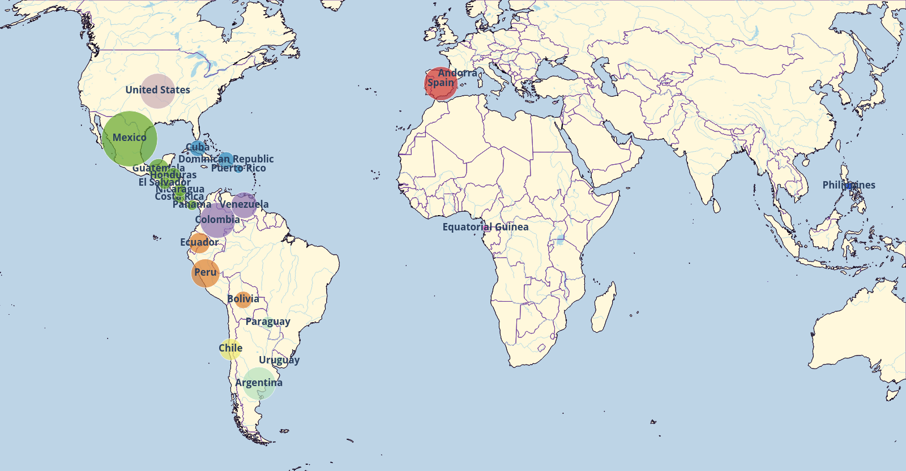

---
# Feel free to add content and custom Front Matter to this file.
# To modify the layout, see https://jekyllrb.com/docs/themes/#overriding-theme-defaults

layout: default
---

# Elote, Choclo and Mazorca: on the Varieties of Spanish {#intro}

<p>Spanish is one of the most widespread languages in the world: it is official language in 20 countries and the second most-spoken native language. Its contact with different coexistent languages and the rich regional and cultural diversity has produced varieties which divert from each other. Still, available corpora and models trained upon them, generally treat Spanish as one monolithic language, which dampers prediction and generation power when dealing with different varieties. CEREAL aims at alleviating the situation by compilling documents from the Web with annotations for 24 countries of origin.</p>

**Figura de ejemplo** no puedo hacerla grande

<p align="center">
  
</p>


## Cultural effects in embeddings {#culture}

<div class="row2cols">
  <div class="column2cols" width="45%">
  
  </div>
  <div class="column2cols" width="40%">
  This is not working. kk2 some more text goes here to chekc the columns, even more in this case
  </div>
</div>


<div class="row2cols">
  <div class="column2cols left">
  
  
  </div>
  <div class="column2cols right">
  kk2 some more text goes here to chekc the columns
  </div>
</div>

## Download the data {#data}

**Tabla de ejemplo**

<table id=dataDownload>
<thead>
  <tr>
    <th colspan="2"></th>
    <th colspan="2">Document Level (#docs)</th>
    <th colspan="2">Sentence Level (#sents) </th>
    <th colspan="2">Embeddings (vocab)</th>
  </tr>
  <tr>
    <th>Country</th>    <th>Code</th>
    <th>CEREAL</th>    <th>CEREALex</th>
    <th>CEREAL</th>    <th>CEREALex</th>
    <th>CEREAL</th>    <th>CEREALex</th>
  </tr>
</thead>
<tbody>
  <tr>
    <td>Andorra</td>    <td>ad</td>    <td><a href="https://zenodo.org/records/3829167/files/de.0.tar.bz2">1,551</a></td>    <td>--</td>    <td><a href="https://zenodo.org/records/3829167/files/de.0.tar.bz2">13,023</a></td>    <td>--</td>    <td>2,671</td>    <td>--</td>
  </tr>
  <tr>
    <td>Argentina</td>  <td>ar</td>    <td><a href="https://zenodo.org/records/3829167/files/de.0.tar.bz2">1,969,559</a></td>    <td><a href="https://zenodo.org/records/3829167/files/de.0.tar.bz2">2,713,759</a></td>    <td>20,958,972</td>    <td>33,854,130</td>    <td>284,191</td>    <td>--</td>
  </tr>
  <tr>
    <td>Bolivia</td>    <td>bo</td>    <td>74,673</td>    <td>--</td>    <td></td>    <td></td>    <td></td>    <td></td>
  </tr>
  <tr>
    <td></td>
    <td></td>
    <td></td>
    <td></td>
    <td></td>
    <td></td>
    <td></td>
    <td></td>
  </tr>
  <tr>
    <td>All</td>    <td>all</td>    <td></td>    <td>--</td>    <td></td>    <td></td>    <td></td>    <td></td>
  </tr>
</tbody>
</table>

The table above shows the statistics (number of documents and unique sentences per language) and the Zenodo download links for CEREAL and CEREALex. The link to the word embeddings built with the sentence level corpus is also added with their vocabulary. Notice that the embeddings are estimated after cleaning the sentence level corpus which is provided only after deduplication and in alphabetical order.

## Download the models {#models}

The classification models trained with our document-level classifier are hosted by [HuggingFace](). 

The table above links to the word embedding models per country and configuration. In order to reproduce the work in XXXX, we also provide embeddings to the 24 Spanish varieties with two additional seeds ([seed 2](), [seed 3]()), and [five embedding models]() for Peninsular Spanish differing in the training data.

## Download the code {#code}

Visit the Github repositories containing the code for the [document level classifier](https://github.com/cristinae/docTransformer), [the stylistic analysis](https://github.com/cristinae/stylometrics) and the analysis of [human biases with CA-WEAT](https://github.com/cristinae/CA-WEAT) lists.


## Citations {#citations}

Please, use the following bibtex entries when citing this research work

```
@InProceedings{espana-bonet-barron-cedeno-2024,
    title = "Elote, Choclo and Mazorca: on the Varieties of Spanish",
    author = "Espa{\~n}a-Bonet, Cristina  and  Barr{\'o}n-Cede{\~n}o, Alberto",
    booktitle = "Proceedings of the 2024 Annual Conference of the North American Chapter of the Association for Computational Linguistics",
    month = jun,
    year = "2024",
    address = "Mexico City, Mexico",
    publisher = "Association for Computational Linguistics",
    url = "https://aclanthology.org/",
    pages = "--"
}
```

