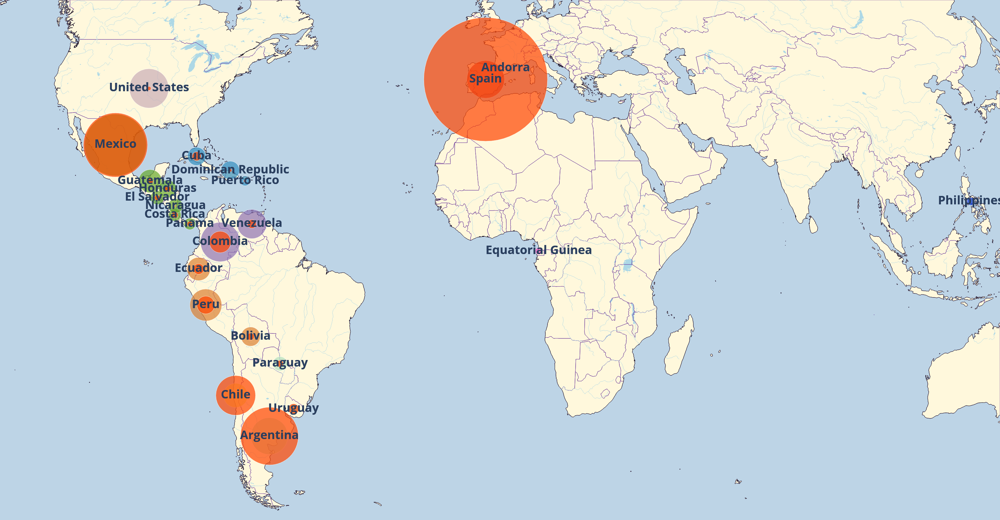
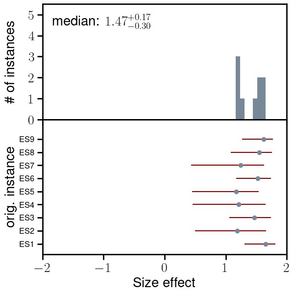
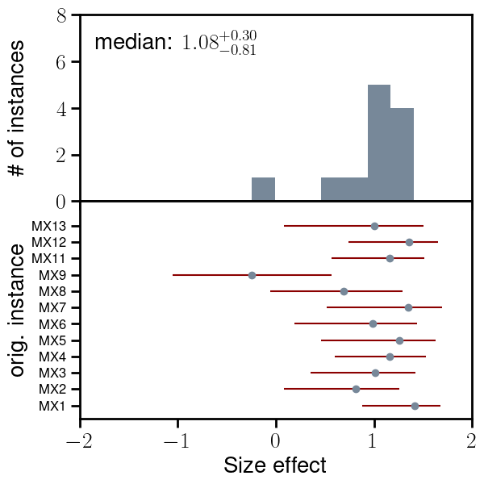
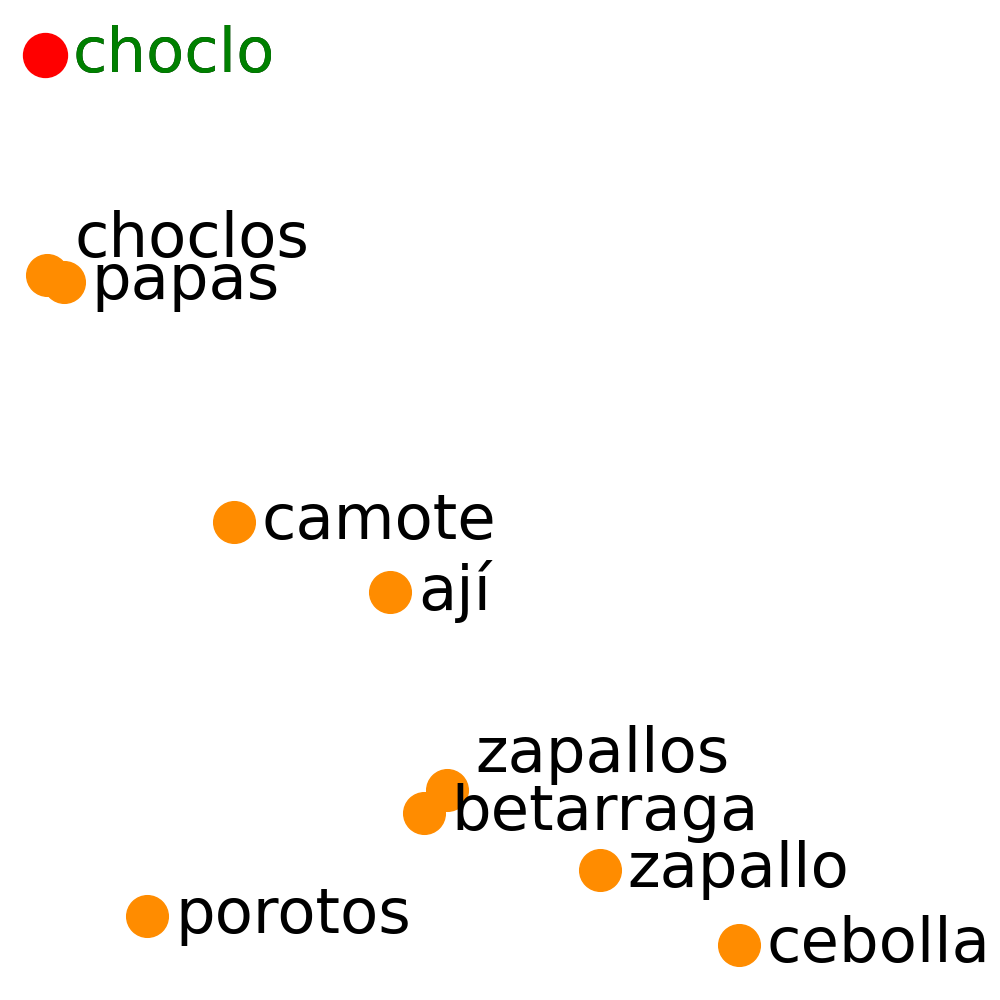
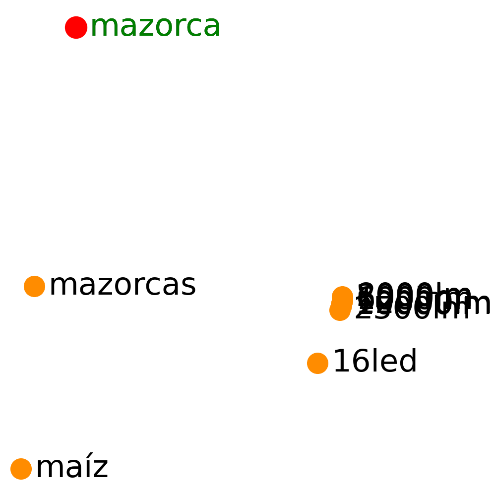
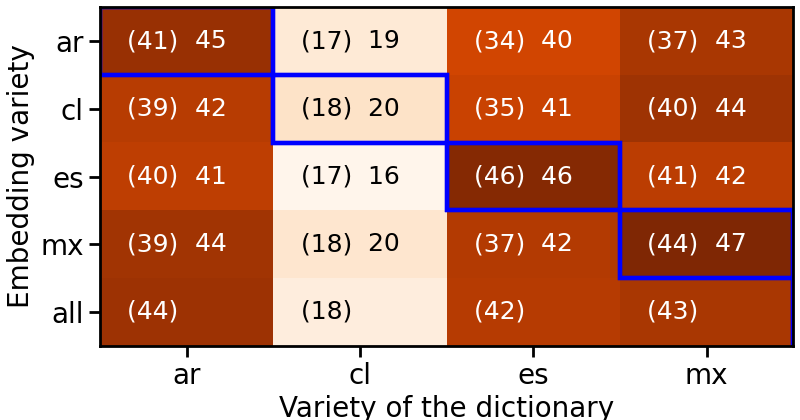
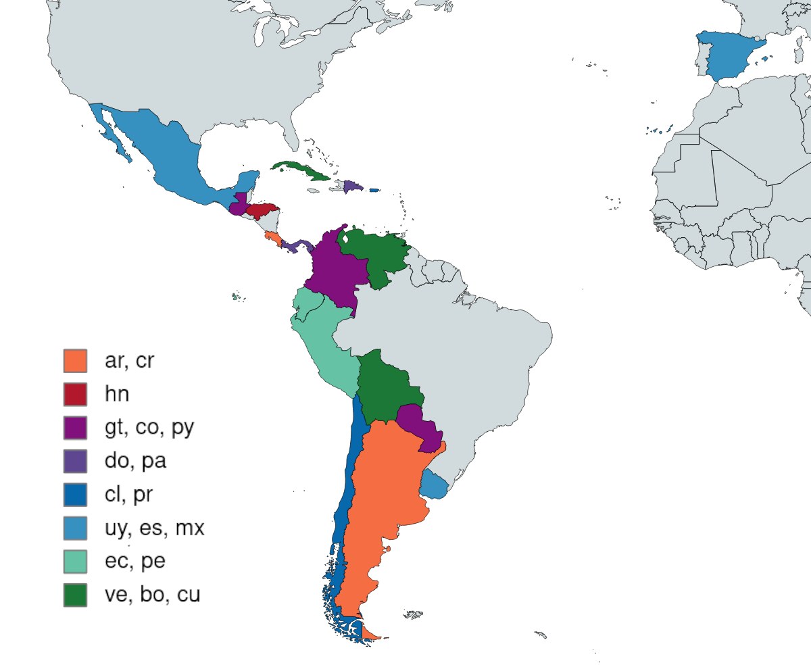
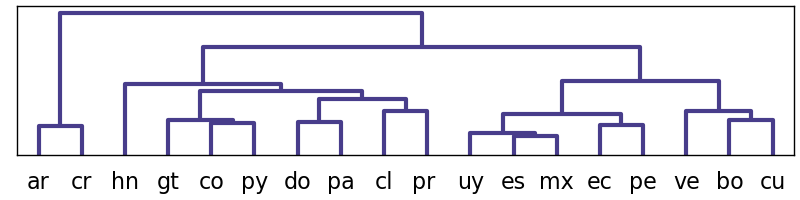

---
# Feel free to add content and custom Front Matter to this file.
# To modify the layout, see https://jekyllrb.com/docs/themes/#overriding-theme-defaults

layout: default
---

# Elote, Choclo and Mazorca: on the Varieties of Spanish

<p>Spanish is one of the most widespread languages in the world: it is an <a href="https://en.wikipedia.org/wiki/List_of_countries_and_territories_where_Spanish_is_an_official_language">official language in 20 countries</a> and the <a href="https://en.wikipedia.org/wiki/List_of_languages_by_total_number_of_speakers">second most-spoken native language</a>. Its contact with different coexistent languages and the rich regional and cultural diversity has produced varieties which divert from each other at different extents. Still, available corpora, and the models trained upon them, generally treat Spanish as one monolithic language, which dampers prediction and generation power when dealing with different varieties. CEREAL aims at alleviating the situation by making available documents from the Web with annotations for 24 countries of origin.</p>
  
<p align="center">  
  <div class="caption">
 <b>Figure 1.</b> Countries where Spanish is spoken. Orange bubbles represent the proportion of documents in CEREAL, while color bubbles represent the population in the country. Mexico, the <a href="https://www.statista.com/statistics/991020/number-native-spanish-speakers-country-worldwide/">country with the highest number of Spanish speakers</a>, is taken as unit measure: countries with a larger ratio documents/population appear in orange, countries with a lower ratio show the superposition of bubbles.</div>
</p>

<br>
## CEREAL & CEREALex {#intro}

<p> CEREAL is a Spanish document-level corpus extracted from <a href="https://oscar-project.org">OSCAR</a> with documents classified according to their country of origin. It covers 24 countries where Spanish is widely spoken. The base corpus, <strong>CEREAL</strong>&ndash;Corpus del Español REAL, contains 13.5 million documents with gold annotations, where the country of origin has been extracted from the information available in the URL of the document. The extended corpus, <strong>CEREALex</strong>, contains 28 million of additional documents with silver annotations, where the country of origin has been automatically assigned using docTransformer, our document-level classifier. 
Following OSCAR, we provide our annotations with <a href="https://creativecommons.org/public-domain/cc0/">CCO license</a>, but we do not hold the copyright of the content text which comes from <a href="https://oscar-project.org/#license">OSCAR</a> and therefore from <a href="https://commoncrawl.org">Common Crawl</a>.
</p>

<br>
## Cultural effects in CEREAL embeddings {#culture}

<p> Different background culture, different lexicon and different grammatical structures present in the country-dependant textual corpora leave their imprint in semantic representations learned from them. In embeddings learned from a monolithic Spanish corpus, these nuances are erased. This is evident when estimating the strength of biases (the size effect) in the semantic spaces and the performance in bilingual lexicon induction (accuracy in BLI). </p>

<p> Human biases are non-pejorative indications of human preferences. Psychologists show through <a href="https://en.wikipedia.org/wiki/Implicit-association_test">Implicit Association Tests</a> (IAT) that humans have positive biases towards flowers (vs insects) and musical instruments (vs weapons) for example. We extend this analysis to word embeddings through our in-house <a href="https://aclanthology.org/2022.emnlp-main.133/">CA-WEAT tests</a> and apply it to CEREAL embeddings <a href="#citations">[1]</a>. 
As the example in Figure 2 shows, there is indeed a difference in the preferences which are rooted in culture. 
</p>

<div class="row2cols">
  <div class="column2cols left">
  Embeddings+CA-WEATs from Spain: &emsp;&emsp;&emsp;&emsp; and from Mexico: 
  
  
  </div>
  <div class="column2cols right">
  <br><br><br><br><br><br>
   <div class="caption" width="90%"> <b>Figure 2.</b> These results for IAT1 (flowers vs insects preference) show that the bias is stronger in Spain than in Mexico. The difference might have cultural reasons behind (some insects being edible in Mexico and not in Spain for instance) and it would be diluted when considering the texts from Spain and Mexico together.</div>
  </div>
</div>

<br>
Lexicon might have big differences in different Spanish-speaking countries. For instance, <em>elote</em>, <em>choclo</em> and <em>mazorca</em>  all mean "corn" in different regions. The word itself has a different usage, being much more frequent in America than in Europe. As Figure 3 shows, in the Mexican embedding space elote appears close to dishes where it is an essential ingredient (e.g., tamales and esquites) but also close to other vegetables (e.g., chiles and calabaza). In the Chilean embedding space, choclo appears surrounded by other vegetables only. This behaviour makes the topology of the embedding spaces different \[2\] and therefore relevant for NLP tasks such as bilingual lexicon induction \[1\].

<p align="center"> 
Mexico: &emsp;&emsp;&emsp;&emsp;&emsp;&emsp;&emsp;&emsp;&emsp;&emsp;&emsp;&emsp;
Chile: &emsp;&emsp;&emsp;&emsp;&emsp;&emsp;&emsp;&emsp;&emsp;&emsp;&emsp;&emsp;
Spain: <br>
 &emsp;&emsp;
 &emsp;&emsp;
 
  <div class="caption">
   <p width="90%"> <b>Figure 3.</b> t-SNE projection of the embedding spaces. The Spanish words equivalent to the English "corn" differ across countries and also do the neighbouring words and their position.</p> </div>
</p>

As example, we induce the VARILEX word dictionaries using VecMap on CEREAL embeddings [1]: <br>
<div class="row2cols">
  <div class="column2cols left">
  <p align="center"></p>
  </div>
  <div class="column2cols right">
  <br><br>
  <div class="caption">  <b>Figure 4.</b> Chosing the embedding space corresponding to the variety of the dictionary we want to induce achieves the highest accuracy, even higher than using the embeddings built with all the available data in any Spanish variety (<em>all</em>). </div>
  </div>
</div>

<br>
The topology of the embedding spaces is different enough so that distances between the spaces allow us to infer differences (and similarities) among varieties. We estimate the distances with several isomorphism metrics and derive dendograms showing the proximity of the varieties \[2\].

<div class="row2cols">
  <div class="column2cols left">
  <p align="center"></p>
  <p align="center"></p>
  </div>
  <div class="column2cols right">
  <br><br><br><br><br><br><br><br><br><br><br><br><br><br><br>
  <div class="caption"> <b>Figure 5.</b> The figure shows the (visual) dendogram obtained with the scores given by the Eigenvalue similarity metric applied on every pair of varieties. According to these results, <em>voseo</em> is the strongest characteristic derived from the CEREAL word embeddings. </div>
  </div>
</div>

<br>
<p>More examples, experiments and the technical details of the document-level classifier, measuring isomorphism between semantic spaces, and the creation and adaptation of our multi-variety resources can be found in [1,2].</p>


<br>
## Download the data {#data}

The table shows the statistics (number of documents and unique sentences per language) for CEREAL and CEREALex. 
All country-specific datasets are <a href="https://zenodo.org/records/11387864/">available through  Zenodo</a>. Click on the red numbers to download the collections for different language varieties at the document and the sentence level.
The link to the word embeddings built with the sentence-level corpora is also added with their vocabulary. Notice that the embeddings are estimated after cleaning the sentence-level corpus which is provided only after deduplication and in alphabetical order without any cleaning.

<table id=dataDownload>
<thead>
  <tr>
    <th colspan="2"></th>
    <th colspan="2">Document Level (#docs)</th>
    <th colspan="2">Fragment Level &emsp;(#frag) </th>
    <th colspan="2">Embeddings &emsp;(vocab)</th>
  </tr>
  <tr>
    <th>Country</th>    <th>Code</th>
    <th>CEREAL</th>    <th>CEREALex</th>
    <th>CEREAL</th>    <th>CEREALex</th>
    <th>CEREAL</th>    <th>CEREALex</th>
  </tr>
</thead>
<tbody>
  <tr>
    <td class="ressalta">Andorra</td>
    <td class="ressalta">ad</td>
    <td><a href="https://zenodo.org/records/11387864/files/cereal.ad.bz2">1,551</a></td>
    <td>&mdash; </td>
    <td class="ressalta"><a href="https://zenodo.org/records/11390829/files/cereal.sentence.ad.bz2">13,023</a></td>
    <td class="ressalta">&mdash; </td>
    <td><a href="https://zenodo.org/records/11390829/files/cerealEmbeddings.ad.vec.bz2">&emsp;2,672</a> [<a href="models/embeddings/tsne/cerealEmbeddings.ad.vec.tsne.bz2">tsne</a>]</td>
    <td>&mdash; </td>
  </tr>
  <tr>
    <td class="ressalta">Argentina</td>
    <td class="ressalta">ar</td>
    <td><a href="https://zenodo.org/records/11387864/files/cereal.ar.bz2">1,969,559</a></td>
    <td><a href="https://zenodo.org/records/11387864/files/cereal.classified.ar.bz2">2,713,759</a></td>
    <td class="ressalta"><a href="https://zenodo.org/records/11390829/files/cereal.sentence.ar.bz2">20,958,972</a></td>
    <td class="ressalta"><a href="https://zenodo.org/records/11390829/files/cereal.classified.sentence.ar.bz2">33,854,130</a></td>
    <td><a href="https://zenodo.org/records/11390829/files/cerealEmbeddings.ar.vec.bz2">284,192</a> [<a href="models/embeddings/tsne/cerealEmbeddings.ar.vec.tsne.bz2">tsne</a>]</td>
    <td><a href="https://zenodo.org/records/11390829/files/cerealExEmbeddings.ar.vec.bz2">532,890</a></td>
  </tr>
  <tr>
    <td class="ressalta">Bolivia</td>
    <td class="ressalta">bo</td>
    <td><a href="https://zenodo.org/records/11387864/files/cereal.bo.bz2">74,673</a></td>
    <td>&mdash; </td>
    <td class="ressalta"><a href="https://zenodo.org/records/11390829/files/cereal.sentence.bo.bz2">976,031</a></td>
    <td class="ressalta">&mdash; </td>
    <td><a href="https://zenodo.org/records/11390829/files/cerealEmbeddings.bo.vec.bz2">53,800</a> [<a href="models/embeddings/tsne/cerealEmbeddings.bo.vec.tsne.bz2">tsne</a>]</td>
    <td>&mdash; </td>
  </tr>
  <tr>
    <td class="ressalta">Chile</td>
    <td class="ressalta">cl</td>
    <td><a href="https://zenodo.org/records/11387864/files/cereal.cl.bz2">1,115,516</a></td>
    <td><a href="https://zenodo.org/records/11387864/files/cereal.classified.cl.bz2">1,095,185</a></td>
    <td class="ressalta"><a href="https://zenodo.org/records/11390829/files/cereal.sentence.cl.bz2">12,100,443</a></td>
    <td class="ressalta"><a href="https://zenodo.org/records/11390829/files/cereal.classified.sentence.cl.bz2">10,077,118</a></td>
    <td><a href="https://zenodo.org/records/11390829/files/cerealEmbeddings.cl.vec.bz2">199,494</a> [<a href="models/embeddings/tsne/cerealEmbeddings.cl.vec.tsne.bz2">tsne</a>]</td>
    <td><a href="https://zenodo.org/records/11390829/files/cerealExEmbeddings.cl.vec.bz2">307,846</a></td>
  </tr>
  <tr>
    <td class="ressalta">Colombia</td>
    <td class="ressalta">co</td>
    <td><a href="https://zenodo.org/records/11387864/files/cereal.co.bz2">649,991</a></td>
    <td>&mdash; </td>
    <td class="ressalta"><a href="https://zenodo.org/records/11390829/files/cereal.sentence.co.bz2">8,331,461</a></td>
    <td class="ressalta">&mdash; </td>
    <td><a href="https://zenodo.org/records/11390829/files/cerealEmbeddings.co.vec.bz2">163,213</a> [<a href="models/embeddings/tsne/cerealEmbeddings.co.vec.tsne.bz2">tsne</a>]</td>
    <td>&mdash; </td>
  </tr>
  <tr>
    <td class="ressalta">Costa Rica</td>
    <td class="ressalta">cr</td>
    <td><a href="https://zenodo.org/records/11387864/files/cereal.cr.bz2">59,069</a></td>
    <td>&mdash; </td>
    <td class="ressalta"><a href="https://zenodo.org/records/11390829/files/cereal.sentence.cr.bz2">826,332</a></td>
    <td class="ressalta">&mdash; </td>
    <td><a href="https://zenodo.org/records/11390829/files/cerealEmbeddings.cr.vec.bz2">45,894</a> [<a href="models/embeddings/tsne/cerealEmbeddings.cr.vec.tsne.bz2">tsne</a>]</td>
    <td>&mdash; </td>
  </tr>
  <tr>
    <td class="ressalta">Cuba</td>
    <td class="ressalta">cu</td>
    <td><a href="https://zenodo.org/records/11387864/files/cereal.cu.bz2">116,390</a></td>
    <td>&mdash; </td>
    <td class="ressalta"><a href="https://zenodo.org/records/11390829/files/cereal.sentence.cu.bz2">1,921,505</a></td>
    <td class="ressalta">&mdash; </td>
    <td><a href="https://zenodo.org/records/11390829/files/cerealEmbeddings.cu.vec.bz2">82,276</a> [<a href="models/embeddings/tsne/cerealEmbeddings.cu.vec.tsne.bz2">tsne</a>]</td>
    <td>&mdash; </td>
  </tr>
  <tr>
    <td class="ressalta">República Dominicana</td>
    <td class="ressalta">do</td>
    <td><a href="https://zenodo.org/records/11387864/files/cereal.do.bz2">113,676</a></td>
    <td>&mdash; </td>
    <td class="ressalta"><a href="https://zenodo.org/records/11390829/files/cereal.sentence.do.bz2">1,184,014</a></td>
    <td class="ressalta">&mdash; </td>
    <td><a href="https://zenodo.org/records/11390829/files/cerealEmbeddings.do.vec.bz2">52,410</a> [<a href="models/embeddings/tsne/cerealEmbeddings.do.vec.tsne.bz2">tsne</a>]</td>
    <td>&mdash; </td>
  </tr>
  <tr>
    <td class="ressalta">Ecuador</td>
    <td class="ressalta">ec</td>
    <td><a href="https://zenodo.org/records/11387864/files/cereal.ec.bz2">157,755</a></td>
    <td>&mdash; </td>
    <td class="ressalta"><a href="https://zenodo.org/records/11390829/files/cereal.sentence.ec.bz2">1,624,840</a></td>
    <td class="ressalta">&mdash; </td>
    <td><a href="https://zenodo.org/records/11390829/files/cerealEmbeddings.ec.vec.bz2">64,313</a> [<a href="models/embeddings/tsne/cerealEmbeddings.ec.vec.tsne.bz2">tsne</a>]</td>
    <td>&mdash; </td>
  </tr>
  <tr>
    <td class="ressalta">España</td>
    <td class="ressalta">es</td>
    <td><a href="https://zenodo.org/records/11387864/files/cereal.es.bz2">5,714,316</a></td>
    <td><a href="https://zenodo.org/records/11387864/files/cereal.classified.es.bz2">15,689,557</a></td>
    <td class="ressalta"><a href="https://zenodo.org/records/11390829/files/cereal.sentence.es.bz2">70,458,818</a></td>
    <td class="ressalta"><a href="https://zenodo.org/records/11390829/files/cereal.classified.sentence.es.bz2">192,199,885</a></td>
    <td><a href="https://zenodo.org/records/11390829/files/cerealEmbeddings.es.vec.bz2">596,843</a> [<a href="models/embeddings/tsne/cerealEmbeddings.es.vec.tsne.bz2">tsne</a>]</td>
    <td><a href="https://zenodo.org/records/11390829/files/cerealExEmbeddings.es.vec.bz2">1,428,724</a></td>
  </tr>
  <tr>
    <td class="ressalta">Guinea Ecuatorial</td>
    <td class="ressalta">gq</td>
    <td><a href="https://zenodo.org/records/11387864/files/cereal.gq.bz2">801</a></td>
    <td>&mdash; </td>
    <td class="ressalta"><a href="https://zenodo.org/records/11390829/files/cereal.sentence.gq.bz2">4,055</a></td>
    <td class="ressalta">&mdash; </td>
    <td><a href="https://zenodo.org/records/11390829/files/cerealEmbeddings.gq.vec.bz2">&emsp;1,699</a> [<a href="models/embeddings/tsne/cerealEmbeddings.gq.vec.tsne.bz2">tsne</a>]</td>
    <td>&mdash; </td>
  </tr>
  <tr>
    <td class="ressalta">Guatemala</td>
    <td class="ressalta">gt</td>
    <td><a href="https://zenodo.org/records/11387864/files/cereal.gt.bz2">51,273</a></td>
    <td>&mdash; </td>
    <td class="ressalta"><a href="https://zenodo.org/records/11390829/files/cereal.sentence.gt.bz2">561,899</a></td>
    <td class="ressalta">&mdash; </td>
    <td><a href="https://zenodo.org/records/11390829/files/cerealEmbeddings.gt.vec.bz2">35,861</a> [<a href="models/embeddings/tsne/cerealEmbeddings.gt.vec.tsne.bz2">tsne</a>]</td>
    <td>&mdash; </td>
  </tr>
  <tr>
    <td class="ressalta">Honduras</td>
    <td class="ressalta">hn</td>
    <td><a href="https://zenodo.org/records/11387864/files/cereal.hn.bz2">59,662</a></td>
    <td>&mdash; </td>
    <td class="ressalta"><a href="https://zenodo.org/records/11390829/files/cereal.sentence.hn.bz2">656,485</a></td>
    <td class="ressalta">&mdash; </td>
    <td><a href="https://zenodo.org/records/11390829/files/cerealEmbeddings.hn.vec.bz2">35,708</a> [<a href="models/embeddings/tsne/cerealEmbeddings.hn.vec.tsne.bz2">tsne</a>]</td>
    <td>&mdash; </td>
  </tr>
  <tr>
    <td class="ressalta">México</td>
    <td class="ressalta">mx</td>
    <td><a href="https://zenodo.org/records/11387864/files/cereal.mx.bz2">2,443,404</a></td>
    <td><a href="https://zenodo.org/records/11387864/files/cereal.classified.mx.bz2">3,314,396</a></td>
    <td class="ressalta"><a href="https://zenodo.org/records/11390829/files/cereal.sentence.mx.bz2">20,883,245</a></td>
    <td class="ressalta"><a href="https://zenodo.org/records/11390829/files/cereal.classified.sentence.mx.bz2">39,410,541</a></td>
    <td><a href="https://zenodo.org/records/11390829/files/cerealEmbeddings.mx.vec.bz2">250,314</a> [<a href="models/embeddings/tsne/cerealEmbeddings.mx.vec.tsne.bz2">tsne</a>]</td>
    <td><a href="https://zenodo.org/records/11390829/files/cerealExEmbeddings.mx.vec.bz2">489,705</a></td>
  </tr>
  <tr>
    <td class="ressalta">Nicaragua</td>
    <td class="ressalta">ni</td>
    <td><a href="https://zenodo.org/records/11387864/files/cereal.ni.bz2">36,880</a></td>
    <td>&mdash; </td>
    <td class="ressalta"><a href="https://zenodo.org/records/11390829/files/cereal.sentence.ni.bz2">405,986</a></td>
    <td class="ressalta">&mdash; </td>
    <td><a href="https://zenodo.org/records/11390829/files/cerealEmbeddings.ni.vec.bz2">31,346</a> [<a href="models/embeddings/tsne/cerealEmbeddings.ni.vec.tsne.bz2">tsne</a>]</td>
    <td>&mdash; </td>
  </tr>
  <tr>
    <td class="ressalta">Panamá</td>
    <td class="ressalta">pa</td>
    <td><a href="https://zenodo.org/records/11387864/files/cereal.pa.bz2">39,027</a></td>
    <td>&mdash; </td>
    <td class="ressalta"><a href="https://zenodo.org/records/11390829/files/cereal.sentence.pa.bz2">449,172</a></td>
    <td class="ressalta">&mdash; </td>
    <td><a href="https://zenodo.org/records/11390829/files/cerealEmbeddings.pa.vec.bz2">31,269</a> [<a href="models/embeddings/tsne/cerealEmbeddings.pa.vec.tsne.bz2">tsne</a>]</td>
    <td>&mdash; </td>
  </tr>
  <tr>
    <td class="ressalta">Perú</td>
    <td class="ressalta">pe</td>
    <td><a href="https://zenodo.org/records/11387864/files/cereal.pe.bz2">441,513</a></td>
    <td>&mdash; </td>
    <td class="ressalta"><a href="https://zenodo.org/records/11390829/files/cereal.sentence.pe.bz2">5,069,664</a></td>
    <td class="ressalta">&mdash; </td>
    <td><a href="https://zenodo.org/records/11390829/files/cerealEmbeddings.pe.vec.bz2">122,885</a> [<a href="models/embeddings/tsne/cerealEmbeddings.pe.vec.tsne.bz2">tsne</a>]</td>
    <td>&mdash; </td>
  </tr>
  <tr>
    <td class="ressalta">Filipinas</td>
    <td class="ressalta">ph</td>
    <td><a href="https://zenodo.org/records/11387864/files/cereal.ph.bz2">109</a></td>
    <td>&mdash; </td>
    <td class="ressalta">&mdash; </td>
    <td class="ressalta">&mdash; </td>
    <td><a href="https://zenodo.org/records/11390829/files/cerealEmbeddings.ph.vec.bz2">&emsp;&emsp;406</a> [<a href="models/embeddings/tsne/cerealEmbeddings.ph.vec.tsne.bz2">tsne</a>]</td>
    <td>&mdash; </td>
  </tr>
  <tr>
    <td class="ressalta">Puerto Rico</td>
    <td class="ressalta">pr</td>
    <td><a href="https://zenodo.org/records/11387864/files/cereal.pr.bz2">11,972</a></td>
    <td>&mdash; </td>
    <td class="ressalta"><a href="https://zenodo.org/records/11390829/files/cereal.sentence.pr.bz2">128,110</a></td>
    <td class="ressalta">&mdash; </td>
    <td><a href="https://zenodo.org/records/11390829/files/cerealEmbeddings.pr.vec.bz2">15,063</a> [<a href="models/embeddings/tsne/cerealEmbeddings.pr.vec.tsne.bz2">tsne</a>]</td>
    <td>&mdash; </td>
  </tr>
  <tr>
    <td class="ressalta">Paraguay</td>
    <td class="ressalta">py</td>
    <td><a href="https://zenodo.org/records/11387864/files/cereal.py.bz2">66,438</a></td>
    <td>&mdash; </td>
    <td class="ressalta"><a href="https://zenodo.org/records/11390829/files/cereal.sentence.py.bz2">775,578</a></td>
    <td class="ressalta">&mdash; </td>
    <td><a href="https://zenodo.org/records/11390829/files/cerealEmbeddings.py.vec.bz2">46,514</a> [<a href="models/embeddings/tsne/cerealEmbeddings.py.vec.tsne.bz2">tsne</a>]</td>
    <td>&mdash; </td>
  </tr>
  <tr>
    <td class="ressalta">El Salvador</td>
    <td class="ressalta">sv</td>
    <td><a href="https://zenodo.org/records/11387864/files/cereal.sv.bz2">41,037</a></td>
    <td>&mdash; </td>
    <td class="ressalta"><a href="https://zenodo.org/records/11390829/files/cereal.sentence.sv.bz2">401,553</a></td>
    <td class="ressalta">&mdash; </td>
    <td><a href="https://zenodo.org/records/11390829/files/cerealEmbeddings.sv.vec.bz2">29,434</a> [<a href="models/embeddings/tsne/cerealEmbeddings.sv.vec.tsne.bz2">tsne</a>]</td>
    <td>&mdash; </td>
  </tr>
  <tr>
    <td class="ressalta">United States</td>
    <td class="ressalta">us</td>
    <td><a href="https://zenodo.org/records/11387864/files/cereal.us.bz2">21,746</a></td>
    <td>&mdash; </td>
    <td class="ressalta"><a href="https://zenodo.org/records/11390829/files/cereal.sentence.us.bz2">378,458</a></td>
    <td class="ressalta">&mdash; </td>
    <td><a href="https://zenodo.org/records/11390829/files/cerealEmbeddings.us.vec.bz2">34,369</a> [<a href="models/embeddings/tsne/cerealEmbeddings.us.vec.tsne.bz2">tsne</a>]</td>
    <td>&mdash; </td>
  </tr>
  <tr>
    <td class="ressalta">Uruguay</td>
    <td class="ressalta">uy</td>
    <td><a href="https://zenodo.org/records/11387864/files/cereal.uy.bz2">153,713</a></td>
    <td>&mdash; </td>
    <td class="ressalta"><a href="https://zenodo.org/records/11390829/files/cereal.sentence.uy.bz2">1,805,013</a></td>
    <td class="ressalta">&mdash; </td>
    <td><a href="https://zenodo.org/records/11390829/files/cerealEmbeddings.uy.vec.bz2">75,492</a> [<a href="models/embeddings/tsne/cerealEmbeddings.uy.vec.tsne.bz2">tsne</a>]</td>
    <td>&mdash; </td>
  </tr>
  <tr>
    <td class="ressalta">Venezuela</td>
    <td class="ressalta">ve</td>
    <td><a href="https://zenodo.org/records/11387864/files/cereal.ve.bz2">109,084</a></td>
    <td>&mdash; </td>
    <td class="ressalta"><a href="https://zenodo.org/records/11390829/files/cereal.sentence.ve.bz2">1,202,227</a></td>
    <td class="ressalta">&mdash; </td>
    <td><a href="https://zenodo.org/records/11390829/files/cerealEmbeddings.ve.vec.bz2">59,335</a> [<a href="models/embeddings/tsne/cerealEmbeddings.ve.vec.tsne.bz2">tsne</a>]</td>
    <td>&mdash; </td>
  </tr>
  <tr>
    <td></td>
    <td></td>
    <td></td>
    <td></td>
    <td> </td>
    <td></td>
    <td></td>
    <td></td>
  </tr>
  <tr>
    <td class="ressalta">Mix</td>
    <td class="ressalta">mix</td>
    <td>&mdash; </td>
    <td><a href="https://zenodo.org/records/11387864/files/cereal.classified.mix.bz2">4,866,901</a></td>
    <td class="ressalta">&mdash; </td>
    <td class="ressalta"><a href="https://zenodo.org/records/11390829/files/cereal.classified.sentence.mix.bz2">61,908,112</a></td>
    <td>&mdash; </td>
    <td>&mdash; </td>
  </tr>
  <tr>
    <td class="ressalta">All</td>
    <td class="ressalta">all</td>
    <td>13,449,155</td>
    <td>27,679,798</td>
    <td class="ressalta">151,116,884</td>
    <td class="ressalta">337,449,786</td>
    <td><a href="https://zenodo.org/records/11390829/files/cerealEmbeddings.all.vec.bz2">736,896</a></td>
    <td>&mdash; </td>
  </tr>
</tbody>
</table>


Those interested in replicating our experiments and resulting models to produce CEREALex can download the corpora used for training the 3-class, 4-class and 5-class classifier.

<table id=dataTrainDownload>
<thead>
  <tr>
    <th colspan="4">Training corpora (docTransformer classifier)</th>
  </tr>
</thead>
<tbody>
  <tr>
    <td class="ressalta">3-class (es, mx, mix)</td>
    <td><a href="https://zenodo.org/records/11390829/files/cereal3C.train.bz2">training</a></td>
    <td><a href="https://zenodo.org/records/11390829/files/cereal3C.dev">validation</a></td>
    <td><a href="https://zenodo.org/records/11390829/files/cereal3C.test">test</a></td>
  </tr>
  <tr>
    <td class="ressalta">4-class (cl, es, mx, mix)</td>
    <td><a href="https://zenodo.org/records/11390829/files/cereal4C.train.bz2">training</a></td>
    <td><a href="https://zenodo.org/records/11390829/files/cereal4C.dev">validation</a></td>
    <td><a href="https://zenodo.org/records/11390829/files/cereal4C.test">test</a></td>
  </tr>
  <tr>
    <td class="ressalta">5-class (ar, cl, es, mx, mix)</td>
    <td><a href="https://zenodo.org/records/11390829/files/cereal5C.train.bz2">training</a></td>
    <td><a href="https://zenodo.org/records/11390829/files/cereal5C.dev">validation</a></td>
    <td><a href="https://zenodo.org/records/11390829/files/cereal5C.test">test</a></td>
  </tr>
</tbody>
</table>


<br>
## Download the models {#models}

The classification models trained with our document-level classifier are hosted by <a href="https://huggingface.co/cristinae/cereal">HuggingFace</a>. 

The table above links to the word embedding models per country and configuration. In order to reproduce the work in \[2\], we also provide embeddings to the 24 Spanish varieties with two additional seeds ([seed 2](https://zenodo.org/records/11390829/files/cerealEmbeddings.seed2.tar), [seed 3](https://zenodo.org/records/11390829/files/cerealEmbeddings.seed3.tar)), and five embedding models for Peninsular Spanish differing in the [training data](https://zenodo.org/records/11390829/files/cerealEmbeddings.es.5partitions.tar) or [seed](https://zenodo.org/records/11390829/files/cerealEmbeddings.es.5seeds.tar).

<br>
## Download the additional resources {#resources}

We collect [CA-WEAT1 and CA-WEAT2]() lists from volunteers in Bolivia, Colombia, Cuba, Ecuador, Mexico and Spain. These lists are used in [1] to quantify human biases in CEREAL embeddings.

We adapt the [VARILEX-R bilingual lexicons](https://h-ueda.sakura.ne.jp/varilex-r/) for English paired to 21 Spanish varieties. We provide a subset of entries both at the [phrase](data/dictionaries/varilexPhrase.tar) and at the [word](data/dictionaries/varilexWord.tar) level. This resource is used in [1] for the bilingual lexicon induction experiments.


<br>
## Download the code {#code}

Visit the Github repositories containing the code for the [document level classifier](https://github.com/cristinae/docTransformer), [the stylistic analysis](https://github.com/cristinae/stylometrics) and the analysis of [human biases](https://github.com/cristinae/CA-WEAT) with CA-WEAT lists.


<br>
## Citation {#citations}

Please, use the following entries when citing this research work.

<div class="citeAPA">
[1] Cristina España-Bonet and Alberto Barrón-Cedeño. Elote, Choclo and Mazorca: on the Varieties of Spanish. <em>In proceedings of the 2024 Conference of the North American Chapter of the Association for Computational Linguistics (NAACL’24)</em>. Mexico City, Mexico, June 2024.
</div>

```
@InProceedings{espana-bonet-barron-cedeno-2024,
    title = "Elote, Choclo and Mazorca: on the Varieties of Spanish",
    author = "Espa{\~n}a-Bonet, Cristina  and  Barr{\'o}n-Cede{\~n}o, Alberto",
    booktitle = "Proceedings of the 2024 Annual Conference of the North American Chapter of the Association for Computational Linguistics (NAACL)",
    month = jun,
    year = "2024",
    address = "Mexico City, Mexico",
    publisher = "Association for Computational Linguistics",
    url = "https://aclanthology.org/",
    pages = "--"
}
```

<div class="citeAPA">
[2] Cristina España-Bonet, Ankur Bhatt, Koel Dutta Chowdhury and Alberto Barrón-Cedeño. When Elote, Choclo and Mazorca are not the Same. Isomorphism-Based Perspective to the Spanish Varieties Divergences. <em> In proceedings of the Eleventh Workshop on NLP for Similar Languages, Varieties and Dialects (VarDial’24)</em>. Mexico City, Mexico, June 2024.
</div>

```
@InProceedings{espana-bonet-et-al-2024,
    title = " When Elote, Choclo and Mazorca are not the Same. Isomorphism-based Perspective to the Spanish Varieties Divergences ",
    author = "Espa{\~n}a-Bonet, Cristina and Bhatt, Ankur and Dutta Chowdhury, Koel and Barr{\'o}n-Cede{\~n}o, Alberto",
    booktitle = "Proceedings of the eleventh Workshop on NLP for Similar Languages, Varieties and Dialects (VarDial)",
    month = jun,
    year = "2024",
    address = "Mexico City, Mexico",
    publisher = "Association for Computational Linguistics",
    url = "https://aclanthology.org/",
    pages = "--"
}
```

